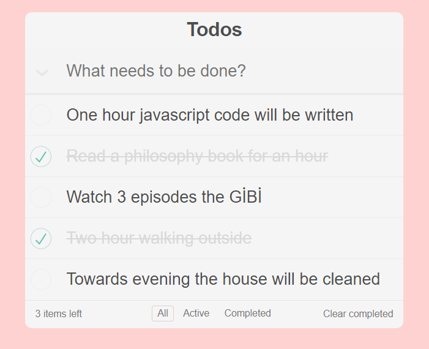
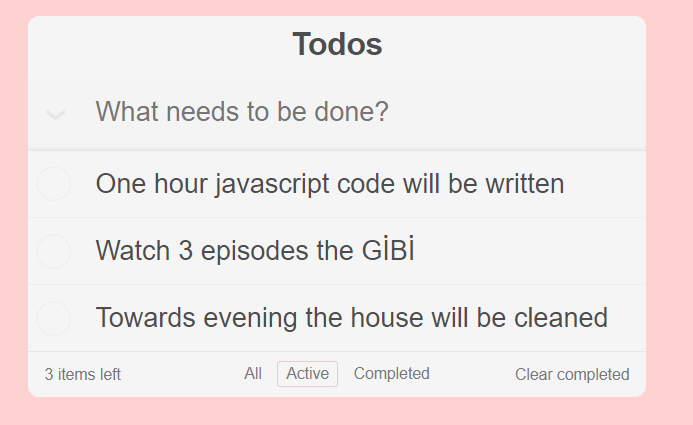
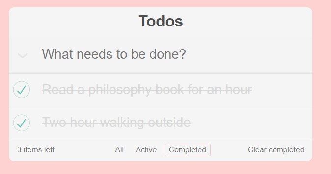
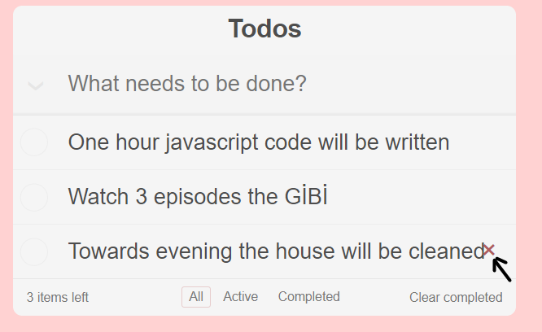
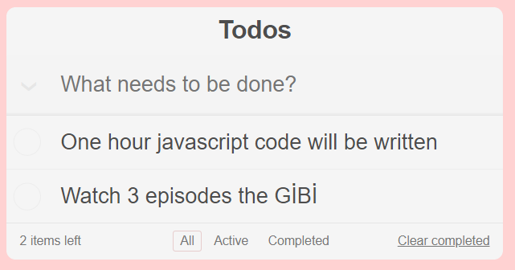
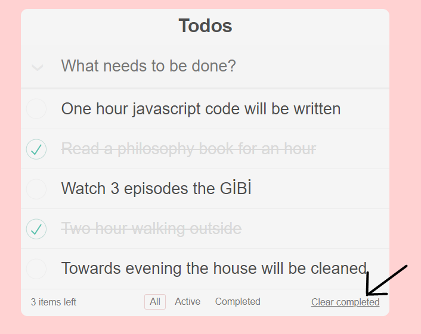
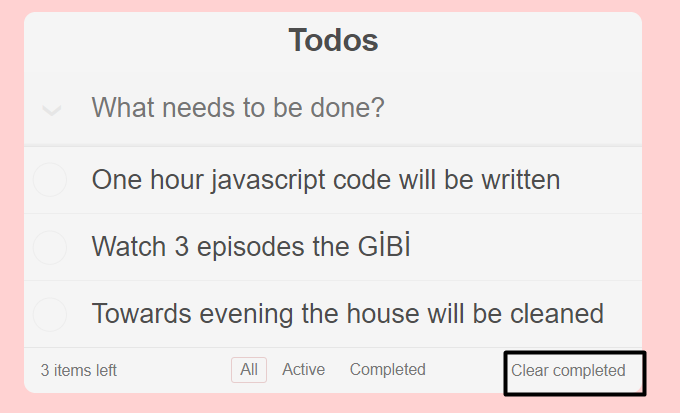
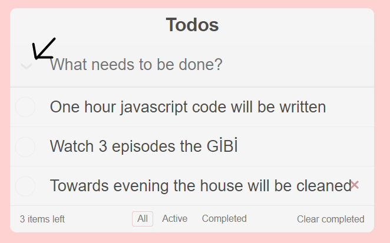
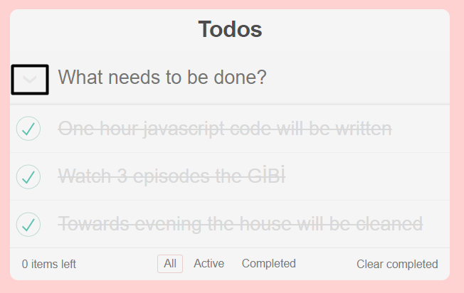

# Create React Uygulamasına Başlarken

Bu proje [Create React App](https://github.com/facebook/create-react-app) ile başlatıldı.

## Kullanılabilir Komut Dosyaları

Proje dizininde şunları çalıştırabilirsiniz:

### `npm start`

Uygulamayı geliştirme modunda çalıştırır.\
Tarayıcınızda görüntülemek için [http://localhost:3000](http://localhost:3000) açın.

## Uygulama Hakkında
Bu projede Props, Component, State ve Lifecycles gibi React konularıın pekiştirilmesi amacıyla yapılacaklar listesi uygulaması yapıldı. Uygulamanın özelliklerine bakalım.

### Ana Ekran

---

### Aktif Yapılacaklar

---

### Tamamlananlar

---

### Görev Silme işlemleri

***Görev Silindikten Sonra***

---

### Tamamlanan Görevleri Silme

***Tamamlanan Görevleri Sildikten Sonra***

---

### Tüm Görevleri Yapıldı Olarak İşaretleme

***Tüm Görevleri Yapıldı Yaptıktan Sonra***

